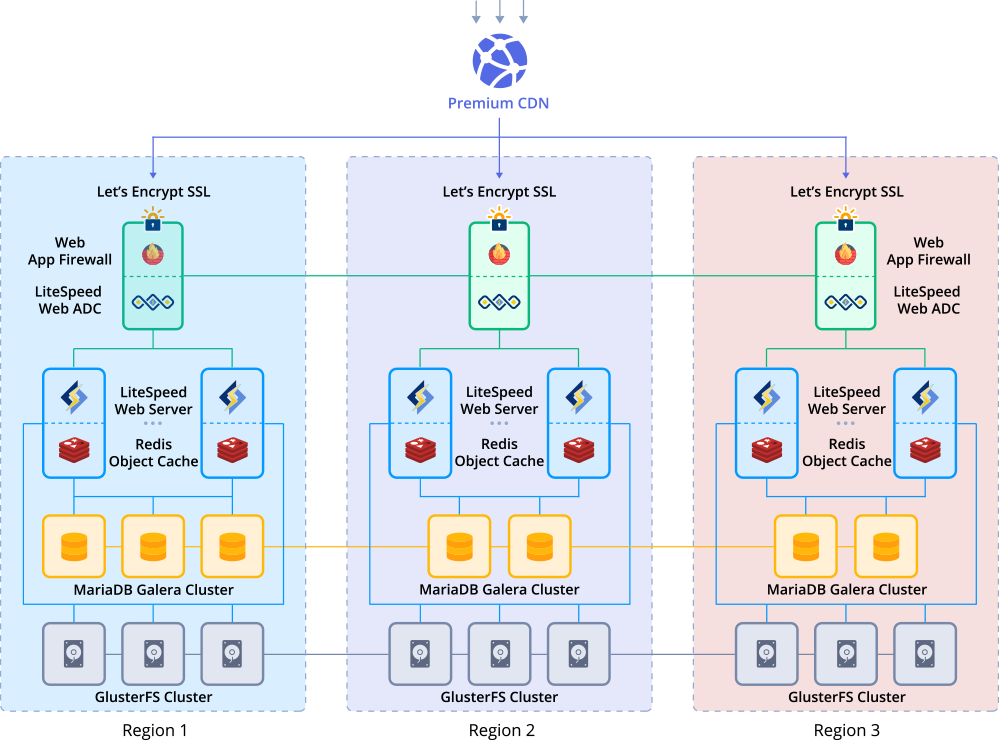
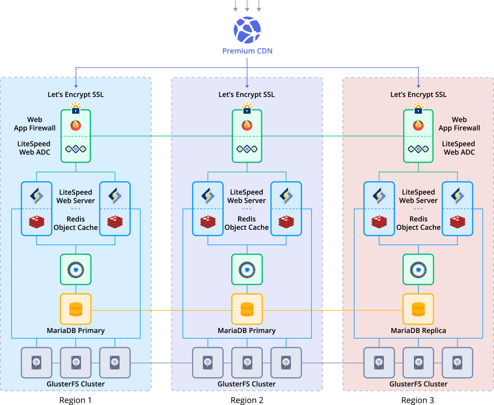
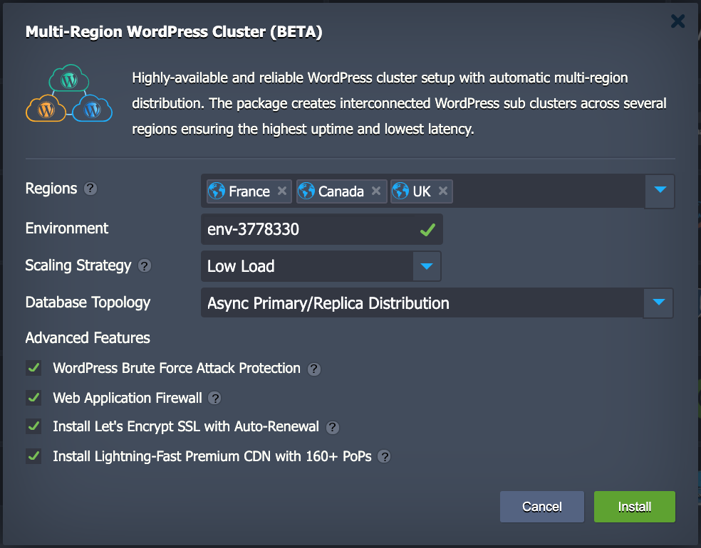
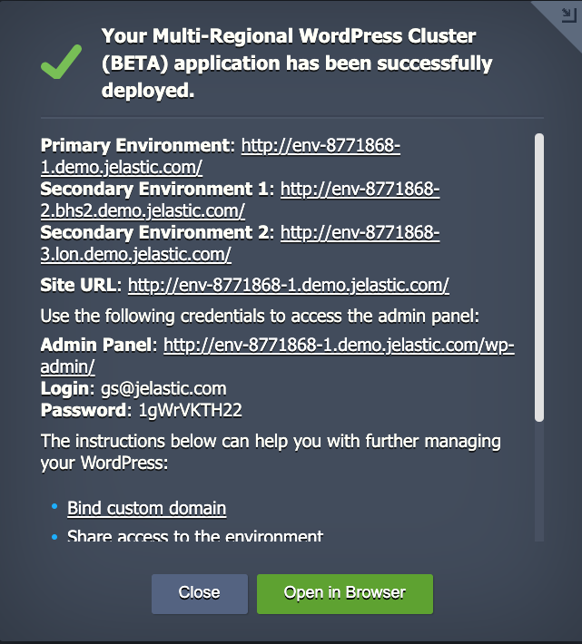

 

# Highly Available Multi-Region WordPress Cluster

Out-of-the-Box Enterprise WordPress Cluster with extra High Availability that can withstand to even cloud datacentre failure

## Cluster Components

Upon the package installation, new environments will be created, one environment per one [Region](https://docs.jelastic.com/environment-regions). Number of Regions may vary between 3 and 5.

Each environment comprises the software stacks as follows:  

  - **Load balancer**: highly available and high-performance **[LiteSpeed ADC](https://docs.jelastic.com/litespeed-web-adc)** which is used for distributing the incoming traffic within a one region  
  
  - **Application server**: highly available and  high-performance **[LiteSpeed Web Server](https://docs.jelastic.com/litespeed-web-server)** the WordPress software runs on. Web servers come with preconfigured **[automatic horizontal scaling](https://docs.jelastic.com/automatic-horizontal-scaling)** to handle load spikes
  
  - **Caching solution**: highly available and high-performance **[Redis](https://docs.jelastic.com/redis/)** object caching storage.  It stores in memory the database query results that have been loaded

  - **Database**:Highly-available **[MariaDB](https://mariadb.org/)** cluster is used to store and operate user data   

  - **Storage**: **[Shared Storage](https://docs.jelastic.com/shared-storage-container)** cluster, ensuring high availablity with GlusterFS, is mounted to all application server nodes for sharing common data     

## Deployment to the Cloud

Click the **Deploy** button below, specify your email address within the widget, choose one of the Jelastic Public Cloud providers where the package is available and press **Install**.

If you are already registered at Jelastic, you can deploy this cluster by importing the  [the package manifest raw link](https://raw.githubusercontent.com/jelastic-jps/wordpress-multiregions/master/manifest.yml) within the dashboard.
 
## Installation Process

In the opened confirmation window at Jelastic dashboard, choose:  

* destination **Regions**. The first chosen Region will be acting as **Primary**   

* **Environment Name**

* preconfigured horizontal **Scaling Strategy**   

* **Database Topology** depending on connection latency value between Regions. In case latency is less than 20 ms we recommend to use **[Sync Galera Distribution](https://jelastic.com/blog/mariadb-galera-cluster-replication/)**, otherwise use **[Async Primary/Replica Distribution](https://jelastic.com/blog/master-master-slave-replication-mysql-mariadb-auto-clustering/)**. This option will affect the whole solution topology:

    * Sync Galera

 

    
    * Async Primary/Replica

 

      
* **WordPress Brute Force Attack Protection** option will protect WordPress admin panel  

* **Web Application Firewall** secure feature that comes with Layer-7 Anti-DDoS Filtering as well as IP level bandwidth and request rate throttling. It won't degrade the LSADC performance since it can be tuned to withstand dynamic requests only.
 
* Traffic encryption is provided by **[Let's Encrypt Add-On](https://jelastic.com/blog/free-ssl-certificates-with-lets-encrypt/)**  with automatic issuing of trusted SSL certificate and Auto-Renewal

* **[Premium CDN](https://jelastic.com/blog/enterprise-cdn-verizon-integration/)** integration in order to provide Lightning-fast static assets loading  

Finally click on **Install**

 

Once the deployment is finished, you’ll see an appropriate success pop-up with URLs for every environment and access credentials to your administration WordPress panel, whilst the same information will be duplicated to your email box.

 

  
So now you can just click on the **Open in browser** button within the shown frame and start filling your highly available and reliable WP installation with the required content, being ready to handle as much users as your service requires.

> **Note:** In case you have decided to move your site to the Multi-Region WordPress Cluster you can migrate it following the Tutorial ["How to Migrate a WordPress Site to Jelastic PaaS](https://jelastic.com/blog/migrate-wordpress-site/) or any other one you prefer.

## WordPress Managed Hosting Business

To start offering this solution to your customers please follow to [Auto-Scalable Clusters for Managed Cloud Business](https://jelastic.com/apaas/)
